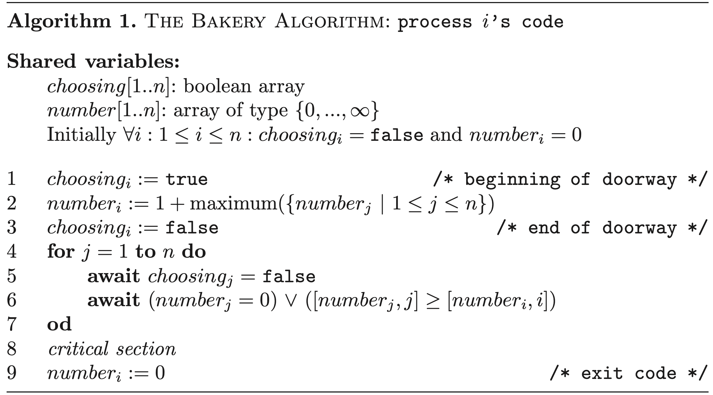
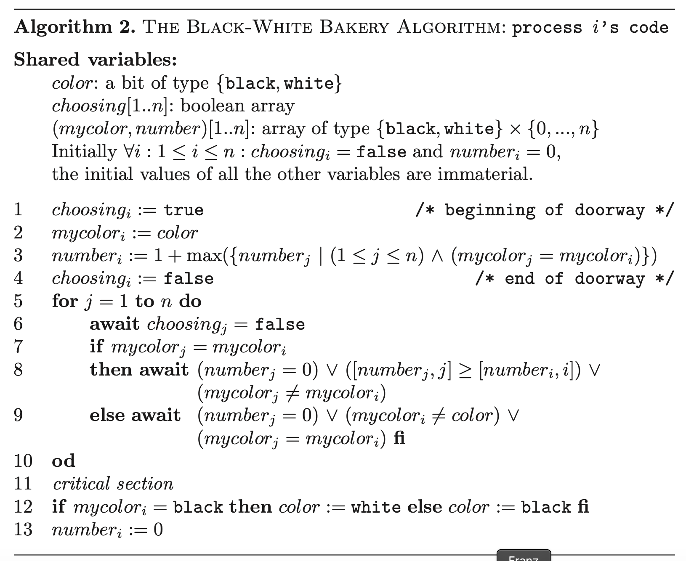

# Taubenfeld Black/White Bakery

Modified Lamports Bakery (probably original version)

## Properties

A mutual exclusion algorithm that (suppossedly) has 4 properties:

1) satisfy FIFO fairness
2) satisfy local spinning
3) adaptive
4) finite number of bounded size atomic registers (in contrast to unbounded lamports)

Uses an additional "color" bit and gives each ticket a "color"

## Basic idea

Ticketing system similar to at the "Amt" in Austria:

- customer receives a ticket with a number (> number of customers waiting) AND color (black/white) upon entry.
- lowest number is served

## More on properties

1) FIFO is "trivial"
2) registers are bounded to size n, where n is number of processes (processes=customer in analogy)

Note: FIFO is a stronger criterium than Mutual Exclusion (ME), Deadlock Freedom(DF) and Starvation Freedom (SF) BUT does not imply SF.

### Local spinning

Spin-waiting: in wait-loop (waiting section), a flag register is "spun" (aka flipped from 0 to 1 and back?) until some *other* process terminates the spin. This spin flag is/was often located on some outside memory (e.g. on another node or w/e) --> possibly generates a lot of network traffic and slows other processes, as the spinning process constantly reads/writes OVER the network.

Local-spinning: a process only spins on a local register --> only 1 *outside* write from another process required to terminate

*Honestly, this all seems kind of obvious...but maybe that was needed? Idk...*

### Adaptive

An alrorithm is adaptive with respect to time complexity measure Phi, if its time complexity Phi is a function of actual number of contending processes.

Adaptive + local spinning = scalable algorithm

*Note: Has something to do with contention of different processes and system response time...will see*

## Black/White bakery

Concept:

- Take ticket_i = (color_i, number_i): read shared bit *color* and set color_i=color. Set number_i > all other tickets with same color.
- Entry to CS is given to "lowest" ticket:
    1. Tickets with color_i != *color* are lower than color_i == *color*.
    2. If 2 tickets have same color, the ticket with lower number is lower.
    3. If 2 tickets are equal, the process with the lower PID is lower
- When a process i leaves the CS, it sets *color* != color_i (to a different color than its own ticket color). This way, priority is given to tickets with same color as i!

Example:
*color* = white
    - Threads 1, 2, 5 (in that order) take tickets colored white
    - Thread 1 completes CS
*color* = black 
    - Threads 3, 4+1 (in that order, 4 and 1 take same number --> 1<4) take tickets colored black
    - Meanwhile: 2, 5 (in that order) execute CS --> *color* stays black
    - Thread 3 (lowest of blacks) enters CS
    - Thread 2 takes ticket colored white (1 < 4 < 2)
    - Thread 3 finishes CS
*color* = white
    - Thread 1 enters CS
    ...

Colors are alternated in blocks, depending on when threads take their tickets.

